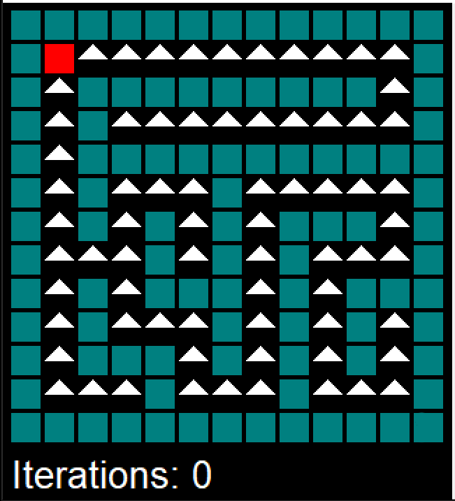
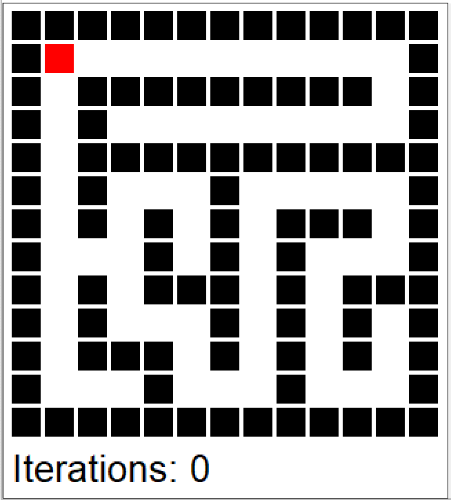
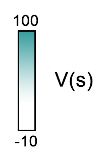
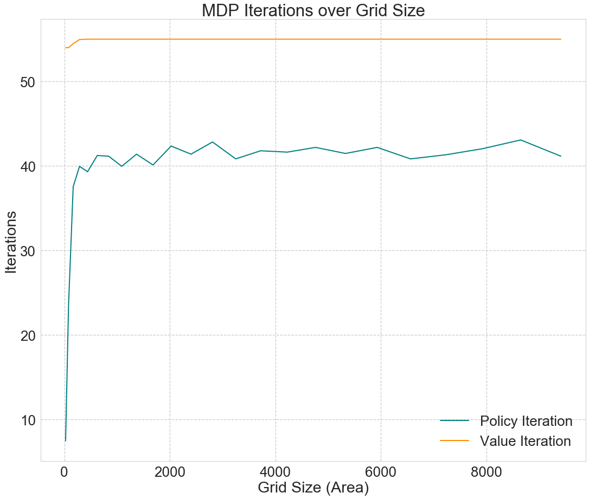
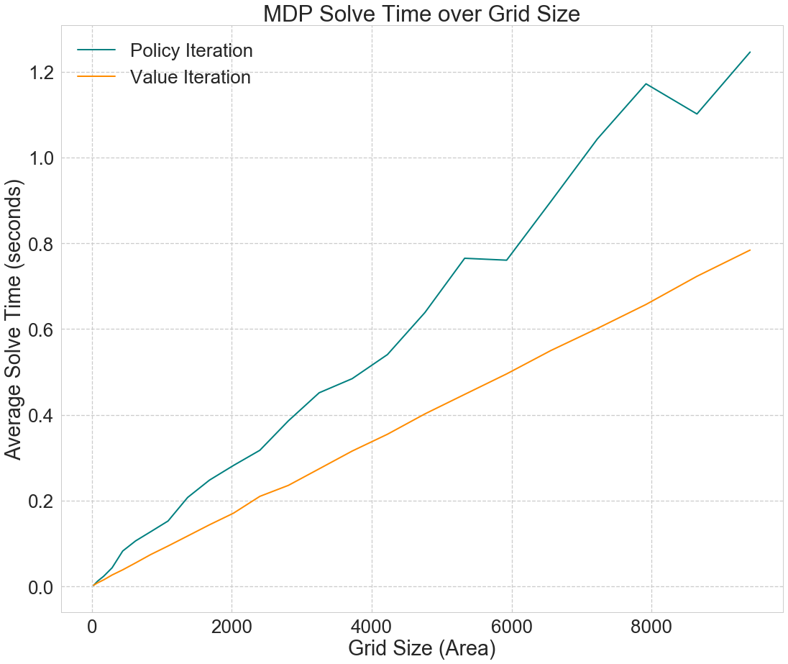
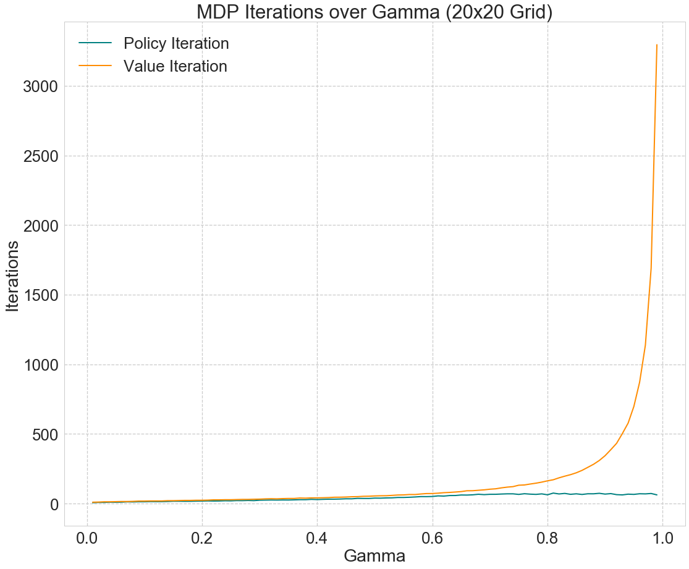
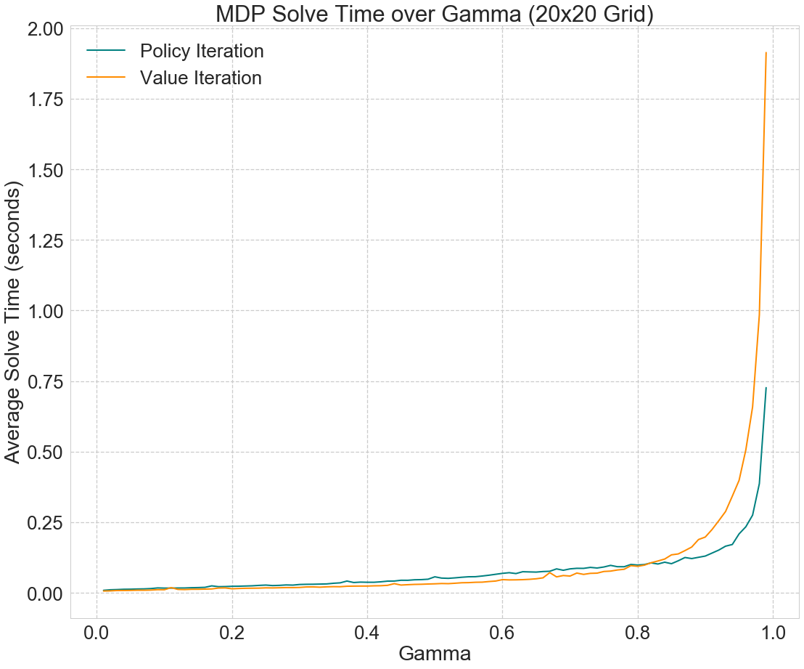

# mazemdp
Exploring MDP solving algorithms with mazes!

Sally Gao, Duncan Rule, Yi Hao

****

## Introduction:
Our central research pursuit is to compare the speed of different techniques for Markov
Decision Processes (MDPs) in the context of solving mazes. Solving MDPs in lower time
complexities is desirable for large problems, as MDPs are widely used as a basis for decision based learning. Two basic algorithms for solving MDPs are value iteration
and policy iteration. In addition to these classic algorithms, one additional technique that may
improve performance is policy iteration with parallel processing; the calculation of V π (s) and π(s)
within each iteration can be parallelized because these values can be derived individually from previous iterations of the algorithm.

The specific research question of this paper is: How does the computation time grow for each
MDP-solving technique as the size and discount factor of the MDP are varied?

We simulate randomized maze environments of varying sizes and compare computation times
and iteration amounts of (A) value iteration, (B) policy iteration and (C) policy iteration with
parallel processing.

## Data:
Our data is in the form of randomly generated maze environments, constructed with an adapted
version of the Aldous Broder maze generation algorithm. The algorithm outputs a grid of a
user-specified size, with each state occupied by either a wall or an empty space. Although the
Aldous Broder algorithm is highly inefficient, it has a simple iterative implementation - this is
necessary because recursive implementations on large maze sizes cause stack overflows in
Python. The algorithm is also beneficial because every possible maze of a given size is generated with equal
probability. The resulting maze is automatically translated into an object oriented
implementation of MDP-focused gridworld: each open space in the maze has reward and value
attributes, as well as attributes linking to neighboring spaces.

## Methods:
  **1. Value Iteration**
  
   The value iteration approach finds the optimal policy π* by calculating the optimal value
   function, V*. Starting with V(s) = 0 for all states s, the values of each state are iteratively
   updated to get the next value function V, which converges towards V*.
      
   

      
  **2. Policy Iteration**
  
   Starting with a random policy π0 , this approach consists of two steps:
      
   I. Calculate the utilities of a non-optimal policy πi
            
   

            
   II. Update the policy using the resulting converged utilities from the previous step to obtain πi+1.
            
   

        
   These steps are repeated until π converges to π*
       
  **3. Parallelized Policy Iteration**
  
   Parallelized policy iteration finds the optimal policy using the same approach as policy
   iteration above. However, in contrast to finding V(s) and π(s) sequentially for all s in
   each iteration, the states are partitioned P groups, which are assigned to P processors.
   In this way, V(s) and π(s) can be obtained in parallel .
      
Using the above approaches to finding the optimal policy, we compare run times and iteration
numbers by following these steps:

   1. For each randomly generated maze, compute both the time and iterations required to
   “solve” the maze using (A) value iteration, (B) policy iteration and (C) policy iteration with
   parallel processing.
      
   2. Repeat using varying maze sizes and gamma values.
      
   3. Create visualizations comparing the algorithms and their responsiveness to grid size and
   gamma values.
   
Policy Iteration           |  Value Iteration          |  Scale
:-------------------------:|:-------------------------:|:-------------------------:
 |   | 
   

<i>Our solvers in action (red state is exit)</i>

            
## Results

We first tested the computational speed and iteration numbers of our MDP solving algorithms by
generating mazes of varying sizes. Fig. 1 shows that grid size has no apparent effect on the
number of iterations required to solve the MDP after a low threshold. On the other hand, Fig. 2
shows that the time required to run the algorithm increases linearly with the area of the grid.
Overall, value iteration outperforms policy iteration in terms of runtime, despite requiring more
iterations to converge to the optimal policy.

Fig. 1                     |  Fig. 2
:-------------------------:|:-------------------------:
 |  

Our implementation of the parallelized policy iteration proved to be extremely inefficient relative
to the other algorithms, as shown in Fig. 3. Without performing specific tests, we have two
primary hypotheses as to why this is the case:

   1. In order to implement parallelization in Python, we used the multiprocessing module.
   There is considerable overhead that is incurred when new processes are created, when
   tasks are dispatched to processes, and when processes communicate with each other.
   
   2. To keep our algorithms comparable, we used the same data structure for the parallelized
   code that we did for value iteration and policy iteration. This data structure involved a
   custom Python class called MDPState for each state, which we stored in a list of lists.
   When it came to implementing parallelized policy iteration, we discovered that this was a
   memory-intensive and inefficient data structure that was unsuitable for parallel
   processes. Because we could not partition our list of states, we had to pass the entire
   grid to each process. Finally, in order to reassemble our results, we had to rewrite the
   “value” attributes of our MDPStates individually by scanning through every element of
   the grid, which takes a considerable amount of time.
   
If given more time, we would rewrite our parallelized policy iteration code using numpy arrays to
represent states and values, which much more efficient and suitable for parallel execution.

<strong>Fig. 3</strong>

Next, we explored the effects of varying the discount factor, gamma, on the time and number of
iterations required to solve the MDPs. Fig. 4 shows that the number of iterations required
increases exponentially with gamma for value iteration, and linearly for policy iteration. For both
policy and value iteration, runtime increases exponentially with gamma.

Fig. 4                     |  Fig. 5
:-------------------------:|:-------------------------:
 |  

## Conclusion

In this project, three techniques for solving MDPs were implemented and tested on mazes of
varying sizes. We conclude firstly that despite requiring fewer iterations to converge, policy
iteration generally takes more time to run than value iteration. We also concluded that the size
of the environment linearly increases the solve time of all three approaches. Finally, solve time
increases exponentially with the discount factor gamma.

In addition to the overhead involved in executing code across multiple processes, the
effectiveness of parallelization depends heavily on the implementation, including data structures
and other design choices.

Future work will focus on building a suitable implementation of parallelized policy iteration in
order to improve performance. In addition, for even larger problems than the ones discussed
here, it is possible to explore alternative algorithms and approximation algorithms for solving
MDPs.
